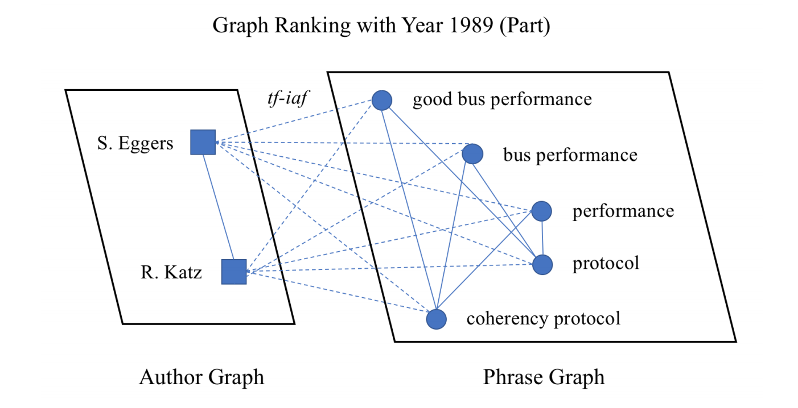

# Identifying Emergent Research Trends by Key Authors and Phrases

This is the repository for the paper [Identifying Emergent Research Trends by Key Authors and Phrases](https://www.comp.nus.edu.sg/~kanmy/papers/identifying-emergent-research.pdf) (COLING 2018). It includes the implementation of the ETD-MGR model illustrated by the paper, as well as some sample outputs to demonstrate how to interpret the results.

## Requirements

Code is written in Python 2.7; it also requires scikit-learn (0.18), numpy (1.13), gensim (3.1), networkx (1.11), NLTK (3.2), and Keras (2.1). 

In addition, you'll need the pretrained Word2Vec [model](https://code.google.com/archive/p/word2vec/) from Google (i.e. the GoogleNews-vectors-negative300.bin file).

## Data

The main experiments are carried out based on the ACM Digital Library dataset, with the metadata state dated 11, Sept, 2015. Raw data is consolidated in XML format, and due to copyright reason we do not release it here. If you want to learn more about the raw dataset, or want to test out our code based on the actual ACM data, please email the authors of the paper, either Shenhao Jiang by **jiangshenhao@gatech.edu**, or Prof. Min-Yen Kan by **kanmy@comp.nus.edu.sg**; once receiving the request, we'll send you a folder of sample XML files from the dataset so you can gain some insights on the raw data.

Nevertheless, in order to help researchers have a better understanding of the code, we will provide some sample outputs from the model. Please refer to *Section Results/Analysis* below for details.

## Run the Code

Running the code is simple, you may perform
```
python doubleGraphExtract.py
```
to extract the noun phrases from the corpora, and calculate their MGR scores in each year. This part of the logic can be illustrated by the following plot:



and you may find the corresponding explanation in Section 3.1 of the paper.

This will generate several files to be used in later stage